<div align="center">

# 🛡️ Threat Detection & Incident Response Labs


Six hands-on labs from a university course on threat detection and incident response — building a detection stack layer by layer, from raw log/traffic analysis up to a working SIEM validated against simulated attacks.

**log & traffic visibility → endpoint protection → network IDS → vulnerability scanning → exploitation → SIEM correlation & attack simulation**

</div>

---

## 🔧 Tools & Technologies

`Wireshark` · `Windows Event Viewer` · `Windows Defender` · `ClamAV` · `Suricata` · `Nmap` · `Metasploit` · `Metasploitable2` · `Elasticsearch` · `Kibana` · `Sysmon` · `Winlogbeat` · `Atomic Red Team` · `rsyslog` · `NXLog`

---

## 📁 Contents

- [Lab 02 — Log & Network Traffic Analysis](#lab-02--log--network-traffic-analysis)
- [Lab 04 — Endpoint Detection & Response](#lab-04--endpoint-detection--response)
- [Lab 06 — Network Intrusion Detection with Suricata](#lab-06--network-intrusion-detection-with-suricata)
- [Lab 08 — Vulnerability Discovery on a Deliberately Vulnerable Host](#lab-08--vulnerability-discovery-on-a-deliberately-vulnerable-host)
- [Lab 10 — Scanning & Exploitation with Metasploit](#lab-10--scanning--exploitation-with-metasploit)
- [Lab 12 — SIEM Deployment & Attack Simulation](#lab-12--siem-deployment--attack-simulation)

---

## Lab 02 — Log & Network Traffic Analysis

Simulated realistic endpoint activity — creating user accounts, installing/removing software, transferring and deleting files, browsing the web — while capturing the resulting evidence from both sides: **Wireshark** for network traffic and native OS logging for host activity, across a Windows and a Linux host.

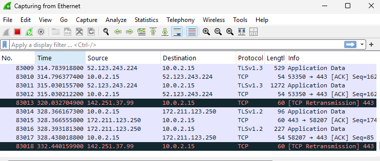

Deliberately triggered failed SSH logins (wrong users/passwords) followed by a successful one, to see the contrast in the logs:

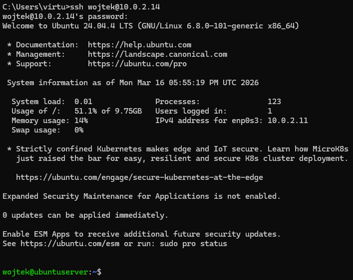

Located and reviewed where each OS keeps its logs — **Event Viewer** on Windows, `/var/log/` on Linux (`/var/log/syslog`, `/var/log/apache2/`, `/var/log/vsftpd.log`) — and enabled live capture on both with `tcpdump`/`tcpflow` on Linux and `pktmon` on Windows.

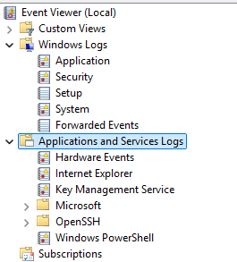

Checked which services/apps were running and set to auto-start on each OS:

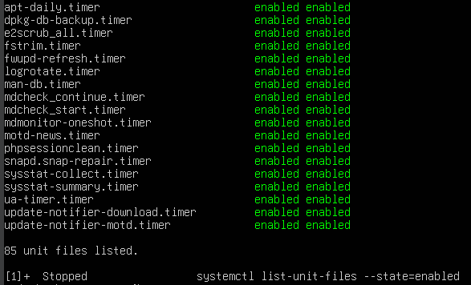

**Centralizing logs:** configured `rsyslog` on a Kali host to receive logs from both the Linux server (TCP/UDP) and, via **NXLog**, from the Windows host — plus configured `logrotate` (`daily`, `rotate 10`, `compress`, `missingok`, `notifempty`) so logs stay manageable over time.

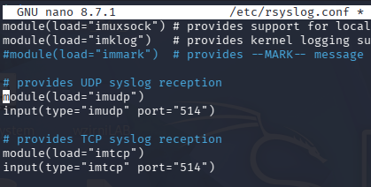

**Takeaways:** confirmed what each OS's default logging *does* and *doesn't* capture out of the box — e.g. neither OS logs file copy/delete operations by default, and Windows needs Local Security Policy / `auditpol` for deeper auth logging — which is exactly the gap that centralized logging + a SIEM (see [Lab 12](#lab-12--siem-deployment--attack-simulation)) is meant to close.

---

## Lab 04 — Endpoint Detection & Response

Explored how Windows' built-in EDR (**Windows Defender**) and an open-source alternative (**ClamAV**) actually perform against real and simulated malware — not just theory.

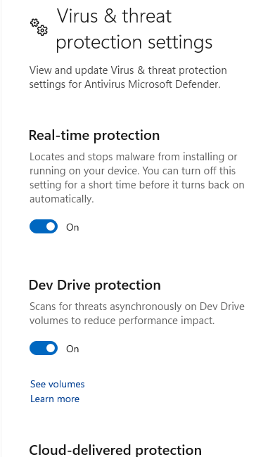

**Round 1 — EICAR test file:** downloaded the industry-standard [EICAR test file](https://www.eicar.org/) to confirm baseline signature detection.

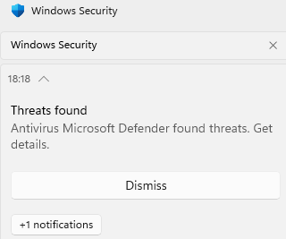

**Round 2 — a "clean" zip:** a first archive extracted without any Defender reaction — until one contained file was opened directly, at which point Defender silently deleted it. This showed Defender reacting to *access*, not just to disk presence.

**Round 3 — a batch of 30 disguised malware samples:** extracting a second archive containing 30 files (renamed known malware samples) triggered a wave of detections:

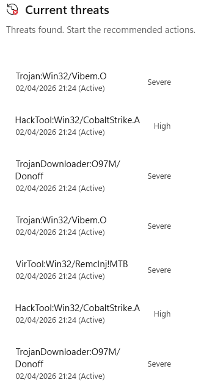

Windows Defender missed 10 of the 30 files. Cross-referencing the same file set against **VirusTotal** showed nearly all 30 were in fact flagged by at least one AV engine there (mostly as trojans/backdoors), which highlights the classic **single-engine blind spot**: no single AV/EDR product has full coverage — layered detection (or a multi-engine service like VirusTotal) catches meaningfully more than any one product alone.

**Round 4 — ClamAV on Linux:** installed **ClamAV**, scanned the same 30-file batch with `clamscan -r`, and compared results.

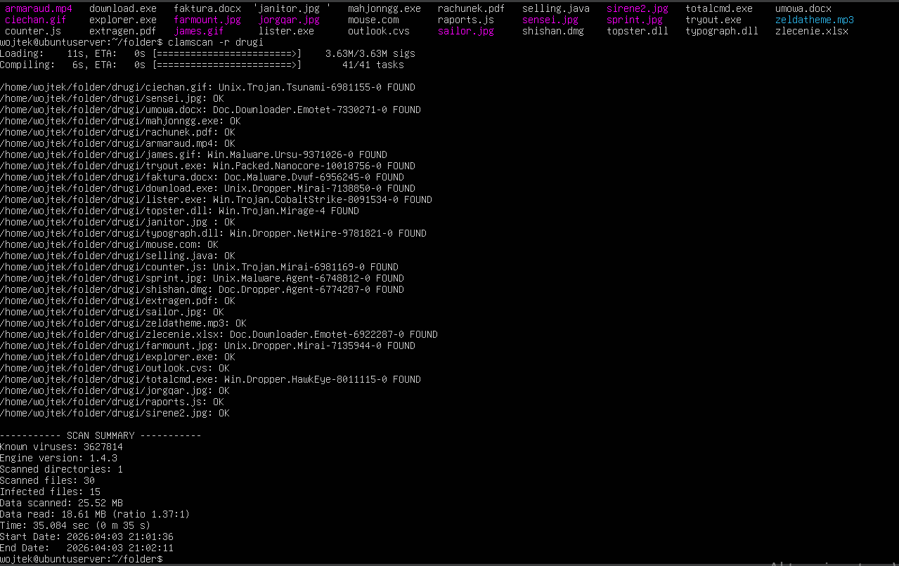

ClamAV detected 15 of 30 — including some Windows-targeted malware families (`Win.Dropper`, `Win.Trojan`) — and correctly flagged the EICAR file by signature.

**Takeaway:** two independent AV/EDR engines, tested against the identical file set, produced different (and both incomplete) detection rates — concrete, first-hand evidence for why layered/EDR-plus-network-detection strategies exist.

---

## Lab 06 — Network Intrusion Detection with Suricata

Deployed **Suricata** as a network IDS and worked through its three operating modes, then built and validated a custom rule set against real attack traffic.

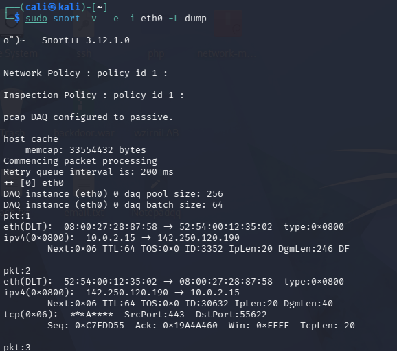

| Mode | Purpose |
|---|---|
| **Sniffer** (`-v`) | Reads and prints packets to the console in real time |
| **Packet Logger** (`-l`) | Writes captured packets to disk for later analysis |
| **NIDS** | Matches traffic against rules and generates alerts |

**Writing custom rules** (`local.rules`) covering 12 distinct detection scenarios, including:

```
alert icmp any any -> any any (msg:"Ping detected"; sid:1000001; rev:1;)
```

- Port scan detection (ports 1–1024)
- FTP brute-force (3+ failed logins)
- SMB DoS / buffer-overflow patterns
- Shellcode injection / suspicious `sudo`, `su`, `runas` over Telnet/RDP
- Malformed HTTP methods and HTTP 500/302 responses
- SQL brute-force (MySQL/PostgreSQL/SQLite)
- Unusual TCP flag combinations (`URG`, `PSH`, `RST`)

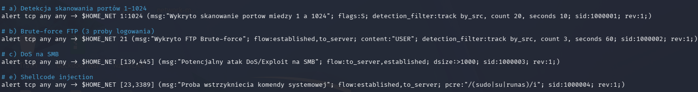

Also integrated external threat intelligence via **MISP**-style rule feeds — **URLhaus** (malicious URL blocklist) and **SSL Blacklist** (flags malicious TLS certificates / JA3 fingerprints associated with botnet C2).

**Validating detection against real attack traffic** (generated with `nmap` and `netcat`):

| Attack | Result |
|---|---|
| TCP Connect scan | ✅ Detected |
| SYN (stealth) scan | ✅ Detected |
| Shellcode / command injection | ✅ Detected |
| Brute-force login attempts | ✅ Detected |
| Custom/malformed TCP flags | ✅ Detected |
| HTTP method enumeration | ✅ Detected |
| Malformed HTTP methods | ❌ Not detected |

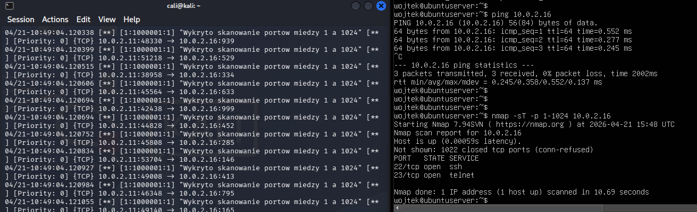
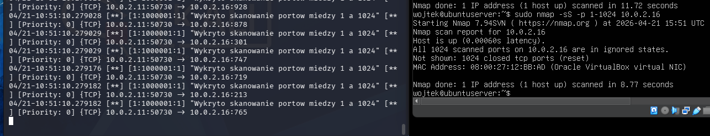
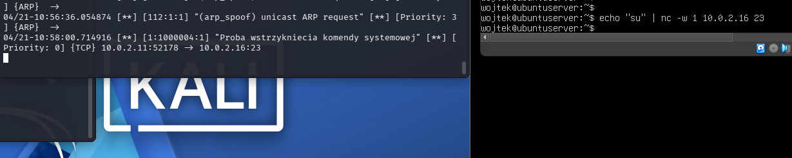
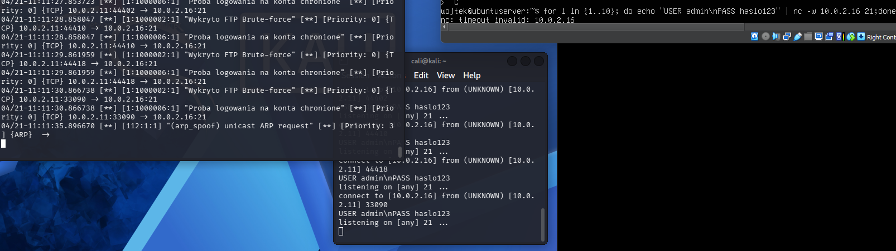

**Takeaway:** rule-writing is only half the job — validating that each rule actually fires against realistic traffic (and understanding *why* one didn't) is what separates a rule set that looks correct from one that works.

---

## Lab 08 — Vulnerability Discovery on a Deliberately Vulnerable Host

Stood up **Metasploitable2** as an intentionally vulnerable target and manually enumerated it from a Kali attack host — the reconnaissance groundwork for the exploitation in [Lab 10](#lab-10--scanning--exploitation-with-metasploit).

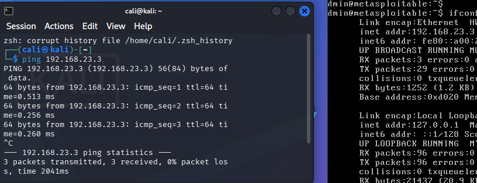

Manual enumeration covered:

- Listening services and ports: `ss -tulnp`
- System/kernel and installed package versions
- User accounts and password policy info
- Privilege-escalation surface: `find / -perm -4000 -type f` (SUID), `find / -perm -2000 -type f` (SGID), and world-writable (`777`) files

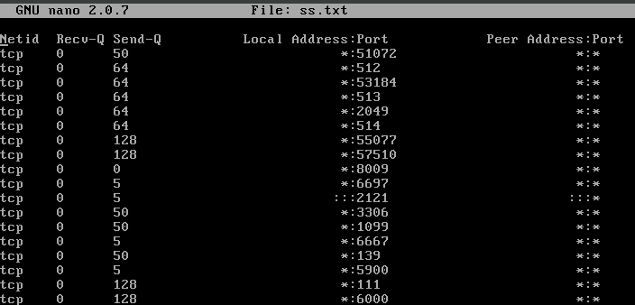
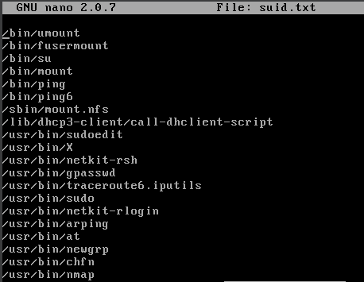

- Service banner grabbing (FTP, SSH, SMTP versions) and an `nmap --script vuln` sweep, which surfaced multiple known vulnerabilities — including an **FTP anonymous login**:

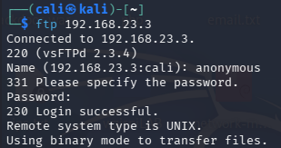

Also performed FTP brute-forcing to confirm weak/default credential exposure.

**Takeaway:** this lab is the "recon → findings list" half of a vulnerability assessment; Lab 10 picks up the same target and turns each finding into a proof-of-concept exploit.

---

## Lab 10 — Scanning & Exploitation with Metasploit

The exploitation counterpart to Lab 08: scanned **Metasploitable2** with Metasploit's own auxiliary scanners (cross-checked against the earlier Nmap/vuln-script results), then built a working proof-of-concept exploit for **8 distinct vulnerabilities**, and finally verified that each one could be mitigated.

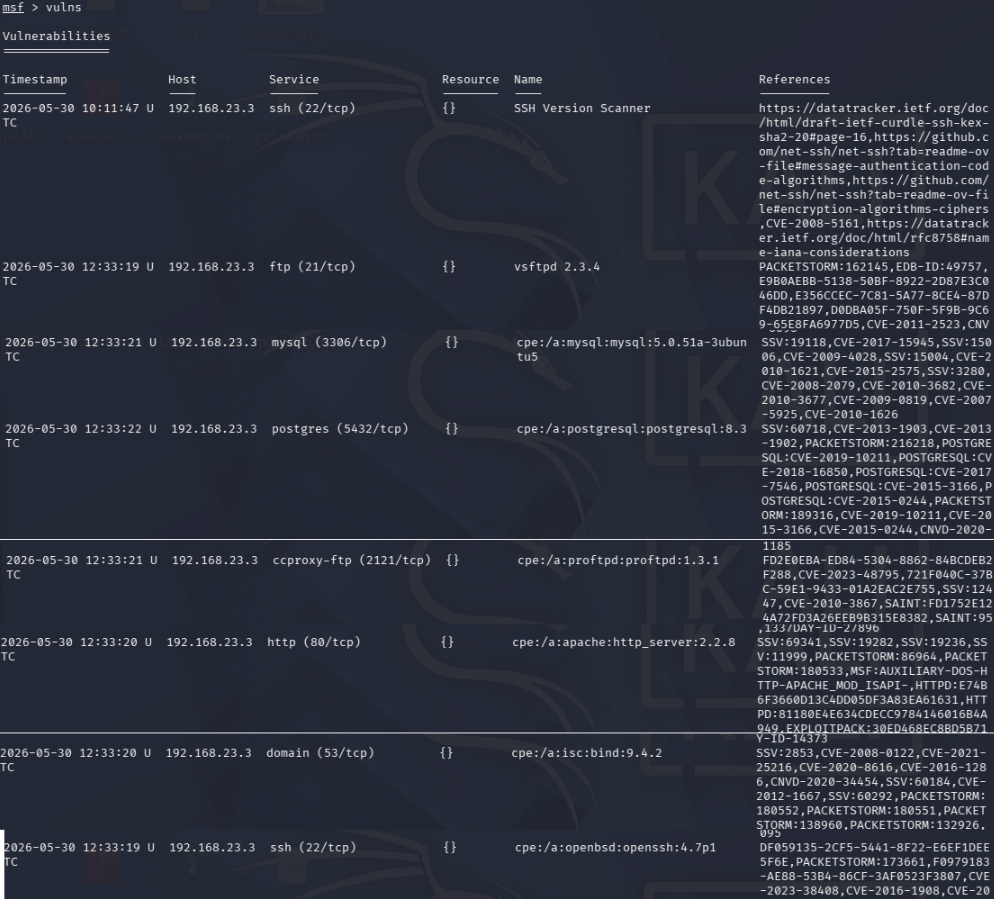

| # | Vulnerability | Port | CVSS | Impact |
|---|---|---|---|---|
| 1 | vsftpd 2.3.4 backdoor | 21 | 9.8 | Remote shell |
| 2 | VNC default credentials | 5900 | 10.0 | Auth bypass ("password") |
| 3 | Ingreslock backdoor | 1524 | — | Unauthenticated root shell |
| 4 | rexec/rlogin misconfiguration | 512–514 | 10.0 | Passwordless login |
| 5 | Java RMI Server | 1099 | — | RCE + file access |
| 6 | PostgreSQL | 5432 | — | Unauthorized file access |
| 7 | UnrealIRCd 3.2.8.1 backdoor | 6667 | — | Root access |
| 8 | Samba `usermap_script` | 139/445 | — | RCE as root |

**Proof of concept for each:**

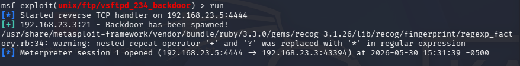
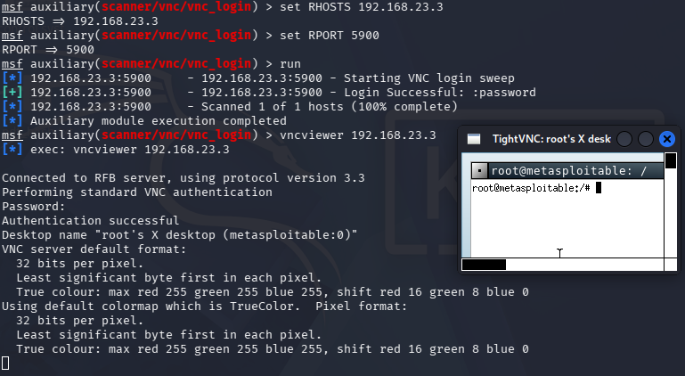
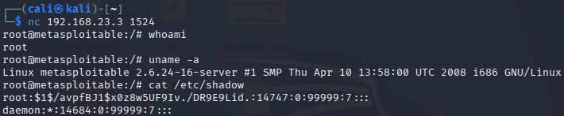
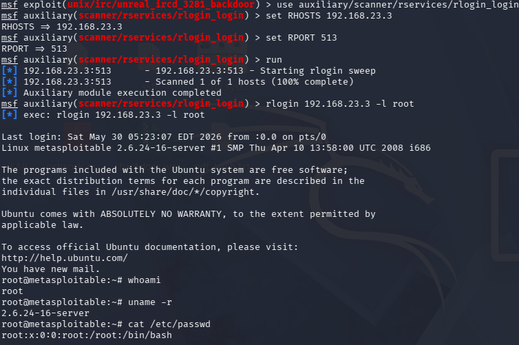
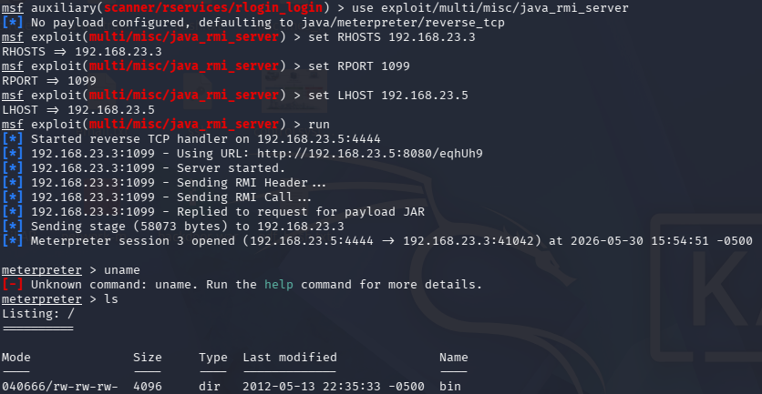
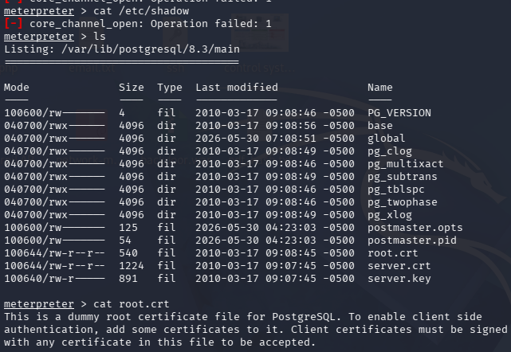
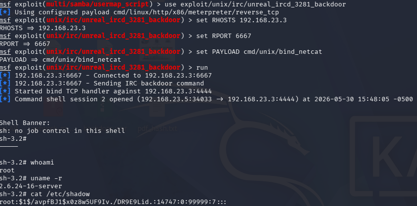
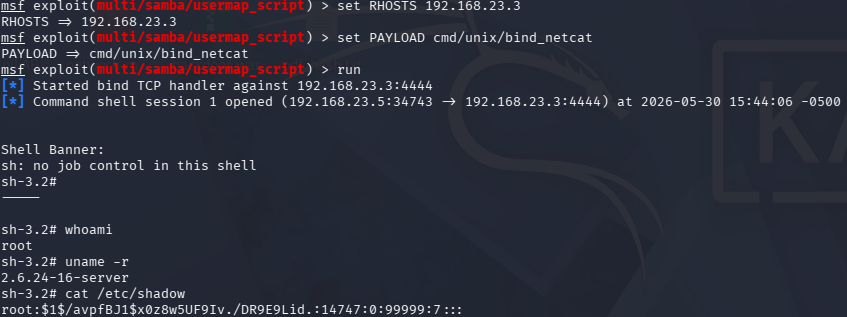

From the vsftpd shell, read `/etc/passwd` and `/etc/shadow` to confirm full-system impact.

**Remediation & re-testing** — each vulnerability was then mitigated and the same exploit re-run to confirm it no longer worked:

- **vsftpd** — removed the compromised package
- **VNC** — changed the default password with `vncpasswd`
- **Ingreslock / rlogin** — commented out the relevant service entries in `/etc/inetd.conf`
- **Java RMI** — blocked the port at the firewall: `sudo iptables -A INPUT -p tcp --dport 1099 -j DROP`
- **PostgreSQL** — changed the default database password
- **UnrealIRCd** — blocked the port: `sudo iptables -A INPUT -p tcp --dport 6667 -j DROP`
- **Samba** — commented out the vulnerable `usermap_script` config entry

All 8 follow-up exploitation attempts failed post-patch, confirming the fixes.

---

## Lab 12 — SIEM Deployment & Attack Simulation

Built a working SIEM pipeline from scratch and then red-teamed it against itself using **Atomic Red Team** to see what it would and wouldn't catch.

**Build:** Elasticsearch + Kibana on a Linux host, configured for single-node operation:

```yaml
# elasticsearch.yml
cluster.name: my-cluster
xpack.security.enabled: false
discovery.type: single-node
network.host: 0.0.0.0
```

```yaml
# kibana.yml
server.name: kibanaserver
server.host: "0.0.0.0"
elasticsearch.hosts: ["http://localhost:9200"]
```

**Telemetry:** deployed **Sysmon** + **Winlogbeat** on a Windows host, pointed at the Elasticsearch/Kibana instance, then loaded the SIEM dashboards.

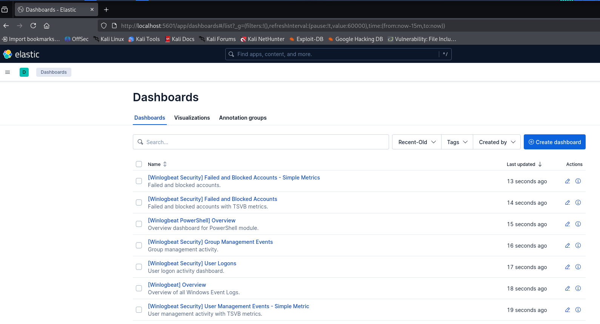

**Attack simulation with Atomic Red Team** — ran real MITRE ATT&CK-mapped techniques against the monitored Windows host and checked whether the SIEM caught them:

| Technique | Result |
|---|---|
| LSASS memory dumping (credential access) | ✅ Detected — full command line captured |
| System Network Configuration Discovery | ✅ Detected |
| PowerShell execution-policy bypass | ✅ Detected |
| Port scanning (Nmap) | ❌ Not detected |
| SMB brute-force | ❌ Not detected |
| Local user/group creation | ❌ Not detected |

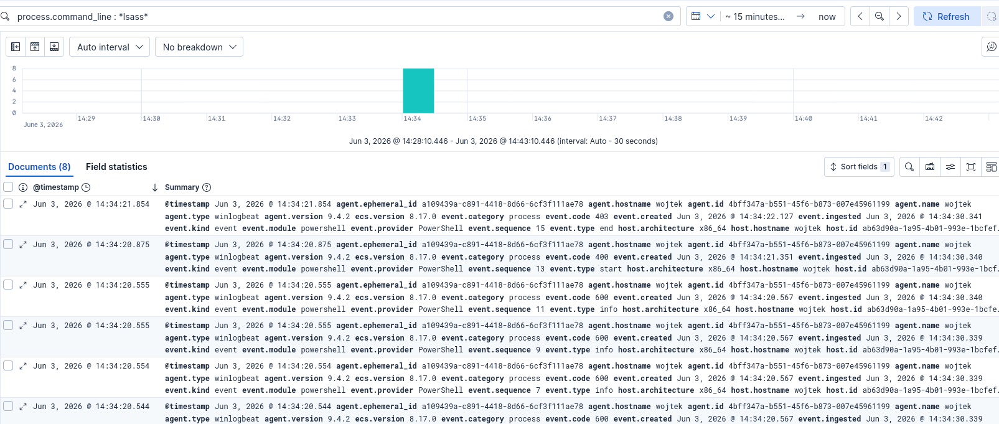
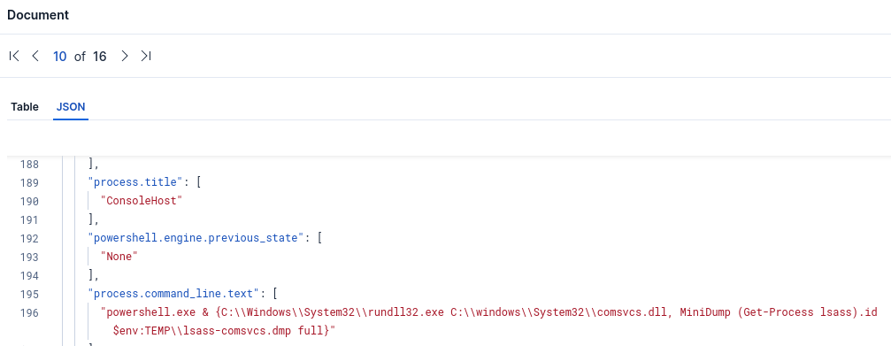
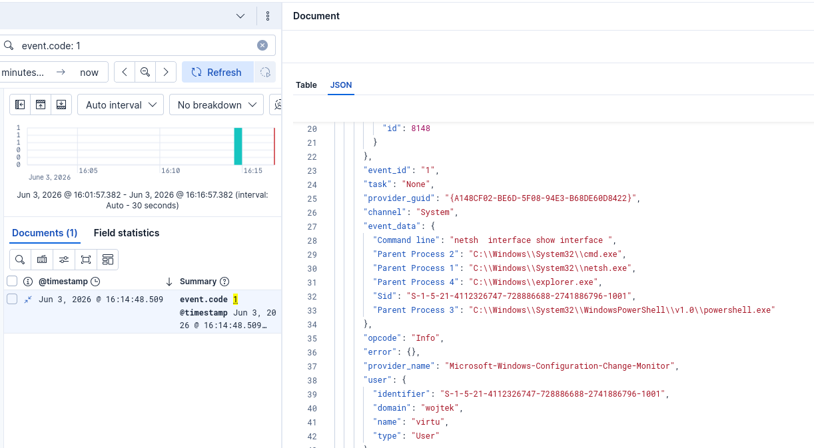

**Takeaway — and an honest one:** roughly half the simulated techniques went undetected, most likely due to endpoint audit-policy/telemetry-source gaps rather than a SIEM/query problem. That gap is itself the useful result: it shows that **deploying a SIEM ≠ having detection coverage** — you have to validate coverage per technique, not assume it.

---

## 🎯 Skills Demonstrated

- Correlating Windows Event Logs with network packet captures (Wireshark)
- Centralizing logs cross-platform with rsyslog / NXLog, with log-rotation hygiene
- Evaluating AV/EDR detection efficacy empirically, across two independent engines
- Writing, tuning, and validating Suricata NIDS rules against real attack traffic
- Integrating external threat-intel feeds (MISP-style: URLhaus, SSL Blacklist)
- Manual vulnerability enumeration (services, SUID/SGID, credentials, banners)
- Exploiting 8 real vulnerabilities with Metasploit, then verifying remediation
- Building a SIEM pipeline (Elasticsearch, Kibana, Sysmon, Winlogbeat) from scratch
- Purple-teaming a SIEM with Atomic Red Team and honestly assessing detection gaps
